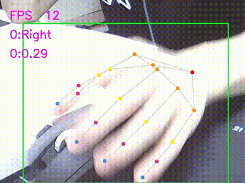

  

# 多线程Socket通信的手势识别

本项目基于TCP连接的Socket通信，具体介绍如下：

## 1. 客户端多线程捕获视频流并上传到服务端
- 客户端利用多线程分别捕获摄像头的视频流。
- 视频流通过TCP连接上传到服务端。
- 同时，客户端接收服务端处理后的视频流。

## 2. 服务端多线程接收并处理视频流
- 服务端利用多线程接收来自客户端的视频流。
- 使用已经训练好的手势识别模型对视频数据进行检测。
- 获取检测结果后，将结果发送回客户端。

## 3. 服务端将检测结果发送回客户端
- 服务端通过TCP连接将检测结果发送回Windows客户端。
- 客户端接收并展示检测结果。

## 用法

1. **部署服务端代码**：
   - 将服务端文件中的代码部署到服务端。

2. **部署客户端代码**：
   - 将其它代码部署在客户端。

3. **运行代码并检测通信**：
   - 先在服务器上运行服务端代码，确保服务端启动成功。
   - 然后在客户端设备上运行客户端代码，确保客户端能够成功连接并与服务端通信。
   - 进行所需的检测和操作。

4. **中断通信并关闭服务端和客户端**：
   - 在检测结束后，按下 `ESC` 键中断通信。
